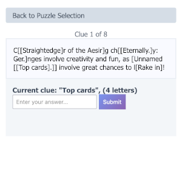
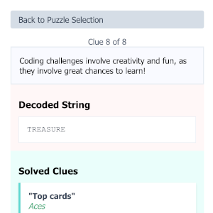

# Code Challenge #2: Secret messages in game boards

Solution to the [second Stack Overflow coding challenge](https://stackoverflow.com/beta/challenges/79651567/code-challenge-2-secret-messages-in-game-boards).  

 -> 

The simple method of encoding a message is a homage to [Bracket City](https://www.theatlantic.com/games/bracket-city/) and [acrostic puzzles](https://en.wikipedia.org/wiki/Acrostic_%28puzzle%29).

There are a few different parts:

* `get_clues.py` downloads a small crossword archive and pulls out repeated clues and answers to find a list of 
possible clues.  It outputs `clues.json`, and caches data as `xwords_data_*.dat` Some ideas to improve this process:
    * Use a different source of clues, perhaps something like Jeopardy!, or some other clue database
    * Maybe use a LLM to create clues, asuming the LLM could create clues a human could solve
    * Consider some way to further filter out hard clues or clues that use "crossword lingo"

* `build_puzzle.py` is the part of the process that builds the puzzle itself, it outputs `puzzle.json`.  Some notes:
    * Put a human in the loop so the clues are not as random
    * Allow a human to actually write the clues as words are picked to enable themes and consistancy
    * Consider using the clues themselves as a hint to the order they need to be solved in (perhaps alphabetical on the second character, for instance)

* `fill_template.py` is the final step that takes the output of build_puzzle and creates `puzzle.html` with the web page.

You can play the [final result online](https://q726kbxun.github.io/so_challenges/entry_002.html).
