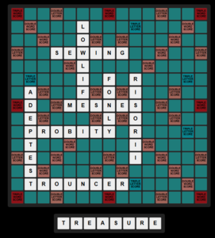

# Code Challenge #2: Secret messages in game boards

## Bracket Acrostic

Solution to the [second Stack Overflow coding challenge](https://stackoverflow.com/beta/challenges/79651567/code-challenge-2-secret-messages-in-game-boards).  

The simple method of encoding a message is a homage to [Bracket City](https://www.theatlantic.com/games/bracket-city/) and [acrostic puzzles](https://en.wikipedia.org/wiki/Acrostic_%28puzzle%29).

There are a few different parts:

* `get_clues.py` downloads a small crossword archive and pulls out repeated clues and answers to find a list of 
possible clues.  It outputs `clues.json`, and caches data as `xwords_data_*.dat` Some ideas to improve this process:
    * Use a different source of clues, perhaps something like Jeopardy!, or some other clue database
    * Maybe use a LLM to create clues, asuming the LLM could create clues a human could solve
    * Consider some way to further filter out hard clues or clues that use "crossword lingo"

* `build_puzzle.py` is the part of the process that builds the puzzle itself, it outputs `puzzle.json`.  Some notes:
    * Put a human in the loop so the clues are not as random
    * Allow a human to actually write the clues as words are picked to enable themes and consistancy
    * Consider using the clues themselves as a hint to the order they need to be solved in (perhaps alphabetical on the second character, for instance)

* `fill_template.py` is the final step that takes the output of build_puzzle and creates `puzzle.html` with the web page.

You can play the [final result online](https://q726kbxun.github.io/so_challenges/entry_002.html).

## Sudoku

`sudoku.py` contains an encoder that creates a solvable Sudoku puzzle embedding a string of up to 8 characters.  It then solves the puzzle and decodes the original string to verify correctness.

One method for generating a Sudoku puzzle is to randomly fill three of the 3x3 boxes (which don't affect each other in the solving process) and then solve the rest of the board.  Each of these boxes has 9! possible permutations, so the total number of combinations across the three boxes is 9!3 - approximately 4.7\*1016. If we want to encode an 8-character string using a character set of 100 printable characters, we need 1008 (or 1.0\*1016) possible combinations. This gives us more than enough unique puzzles to encode any such string.

This script follows that idea: it first converts the input string into a numerical value. That value is then used to select specific permutations for the diagonal boxes (from top-left to bottom-right). To be cute, the script removes some cells from the puzzle - while ensuring that the encoding boxes still have a unique solution - to create a valid Sudoku challenge. Finally, it solves the puzzle and decodes the message to confirm the process works end-to-end.

## Scrabble

`scrabble.py` is an encoder and decoder that can encode a message to a valid Scrabble game board.  It includes a simple replacement cipher so that the encoded message isn't obvious on the board.
