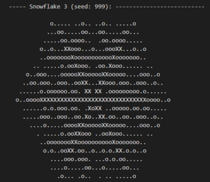

# Code Challenge #2: Secret messages in game boards

## Snowflakes

Solution to the [third Stack Overflow coding challenge](https://stackoverflow.com/beta/challenges/79669436/code-challenge-3-creating-ascii-art-snowflakes).

Simeple method to draw an ASCII snowflake.  Just draw six branches, and add sub branches at random.
